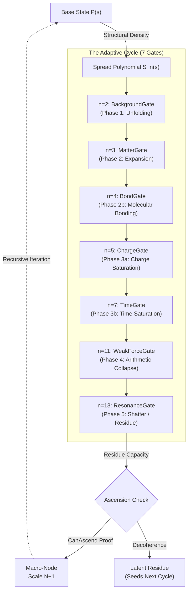

# Evolution Engine Verification

This module provides the rigorous QuickCheck proofs for the physics evolution engine, specifically focusing on the phase transitions (Scale Ascensions).

## The Adaptive Cycle & Spread Polynomial

The Evolution engine is purely driven by the recursive convolution of spread polynomials across a 7-gate phase sequence. The structural density of the state itself dictates the degree of the polynomial expansion.




```idris
module Evolution.Evolution

import QuickCheck
import Simplex.Core
import Math.Multiset
import Evolution.Cycle
import Evolution.Clock
import Evolution.Transform
import Symmetry.Common

%default total
```

## Total Inner Polynomial Mass

Calculates the total inner polynomial mass (sum of all coefficients) of a state vector. This extracts the true quantum mass from the underlying `IntPolynumber` elements.

```idris
totalPolyLag : SparseMaxel -> Integer
totalPolyLag m = 
  foldl (\acc, ((_, poly), count) => acc + count * multiplicityAll poly) 0 (multisetToList m)
```

## Ascension Mass Conservation

Verifies that ascending a scale perfectly preserves the total mass (Leibniz Lag) of the state vector. When the micro-history annihilates into a macro-node, all polynomial energy is structurally conserved. The integer mass invariant cannot be violated!

```idris
public export
prop_ascensionConservesMass : Property
prop_ascensionConservesMass = forAll genUniverseStateWithDepth (MkFn (\(depth, u) => 
  let targetNode = MkPixel 0 0
      ascendedField = ascendScale targetNode u.stateVector
      originalMass = totalPolyLag u.stateVector
      ascendedMass = totalPolyLag ascendedField
  in property (originalMass == ascendedMass)))
```

## Empty Vacuum Anchor

Verifies that if a state vector is entirely empty, it can never trigger a topological ascension (because there is no geometric mass to cross the capacity limit).

```idris
public export
prop_emptyNeverAscends : Property
prop_emptyNeverAscends = property (canAscend Blue emptySubstrate emptySparseMaxel == False)
```
