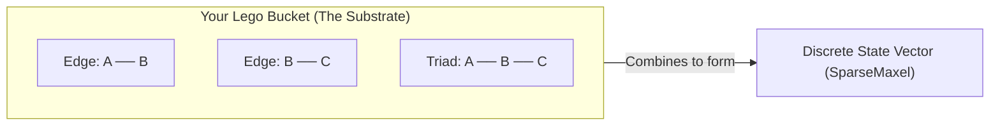
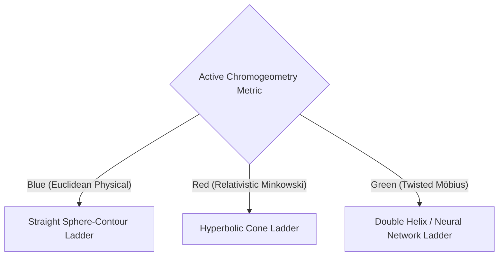
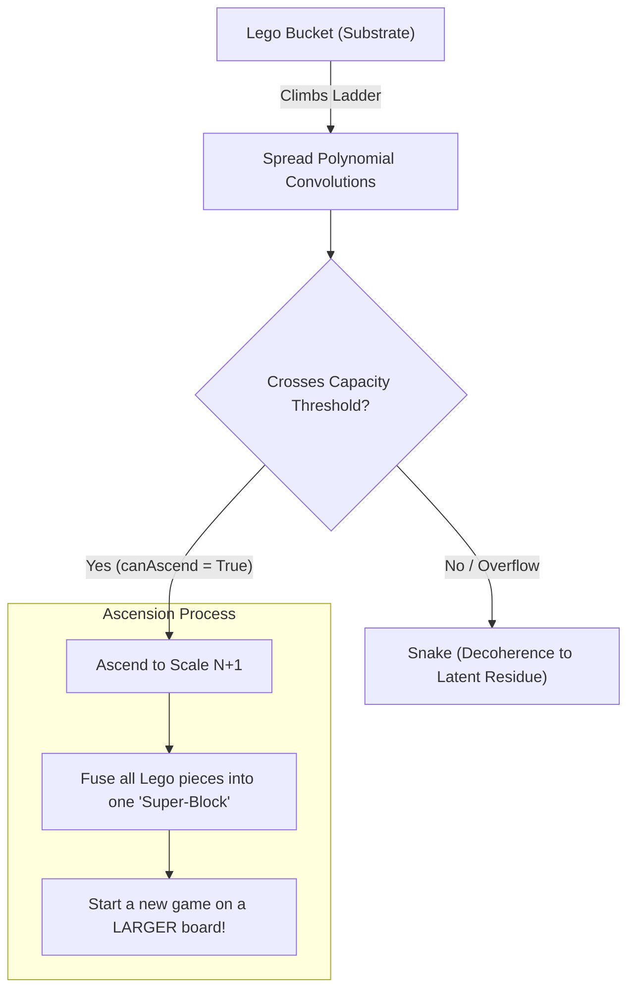

# Cosmic Snakes and Ladders: A Playful Guide to the Universe Engine

This document provides a highly intuitive, physical analogy for the discrete multiset physics engine in the `idris2-Universe` codebase. If you have ever felt lost in the formal mathematics of chromogeometric spread polynomials, think of the entire manifest universe as a grand game of **Snakes and Ladders**.

---

## The Analogy at a Glance

| Physical Concept | Snakes & Ladders Equivalent | Code Reference / Mechanism |
| :--- | :--- | :--- |
| **The Universe / Spacetime** | The Game Board (Grid of Squares) | `Pixel` / `Geometry` (Discrete coordinates) |
| **The Substrate** | A bucket of Lego blocks carried by the player | `Simplex.Core.Substrate` (Local network edges & vertices) |
| **The State Vector** | The specific assortment of Lego pieces in the bucket | `SparseMaxel` (The multiset of active states and amplitudes) |
| **The Spread Polynomial** | **The Ladder** (Steps for climbing to higher states) | `Evolution.SpreadPolynumber.generateLocalSpreadPoly` |
| **Step Progression** | Moving up a rung and receiving new Lego shapes | Polynomial multiplication (`mulIntPoly`) adding new exponents |
| **Chromogeometry** | Bending, twisting, or branching the ladders | Chromogeometric metrics (`Blue`, `Red`, `Green`) via `spreadNL` |
| **Decoherence** | **The Snake** (Sliding down and scattering your blocks) | The capacity limit and latent residue fallback in `partitionLogic` |
| **Ascension** | Fusing the bucket into a "Super-Block" and starting a new board | `canAscend` / `ascendScale` (Transitioning to the next macro-scale) |

---

## 1. The Game Board and the Lego Bucket (The Substrate)

In this game, the board is not a flat paper grid. It is a discrete network of coordinates (`Pixel Integer` in 2D or 3D) connected by local pathways. 

As a player, you walk across this board carrying a **bucket of Lego blocks**. This bucket is the **Substrate**:
* The individual blocks in your bucket are the edges and vertices of the local pixel graph.
* The way you stack them together represents physical matter (`SparseMaxel`).
* Some blocks are simple ("latent" background pieces), while others are highly active ("visible" pieces with complex energy states).

---

## 1.5. How the Game Starts: The Photon-Only Bucket

When the game first starts (prior to the creation of matter), your bucket is incredibly simple:

> [!IMPORTANT]
> At the very beginning of cosmic time, your bucket contains **only pure radiation and photons**. There are no massive quarks, no protons, and no electrons. 

This starting state is governed by the following mechanics:
*   **The Timeless State**: The photons inside have exactly **zero quadrance** in the relativistic **Red Metric** ($x^2 - y^2 = 0$). Because of this, their propagation speed across the board is locked exactly at the speed of light:
    $$\text{Red Quadrance} = 0 \implies \text{Speed} = \pm 1$$
*   **Zero-Remainder Vacuum**: The initial radiation carries a perfect Boole-Möbius symmetry (`isZeroRemainder` = `True`), representing a flat, unknotted energy sheet in the 2D plane.
*   **Climbing to Create Matter (Baryogenesis)**: As you climb the ladders by convolving with local spread polynomials, you accumulate informational energy density. Once the total energy density of these photons crosses the **128-state vacuum capacity limit** (`checkBaryogenesisTrigger`):
    1. A **Pigeonhole Conflict** is triggered because the 2D spectral pool saturates.
    2. The 2D sheet is forced to twist and spill over into a **3D manifest space**.
    3. The pure radiation condenses, unlocking **baryonic matter blocks** in your bucket—allowing quarks, nucleons, charges (`Electron`), and molecular bonds to exist!

---

## 2. The Ladder: The Spread Polynomial

To move upward in complexity (from raw energy to quarks, atoms, and eventually molecules), you must climb **Ladders**. In the codebase, these ladders are represented by the **Spread Polynomial** (`generateLocalSpreadPoly`):

> [!NOTE]
> In traditional board games, a ladder is a simple shortcut. In `idris2-Universe`, the ladder is a dynamic structure built out of the spatial relationships of the Lego blocks in your bucket!

When your bucket is positioned at a specific coordinate, the engine looks at all the local triads (three-block structures) touching that point:
1. It calculates the **fractional spread** (`spreadNL`) between these neighboring blocks using the active metric.
2. It sums these local twists into a single, reduced integer: `localTwistVal`.
3. It maps this twist directly into unique polynomial exponents (modulo `13` and `137`).

$$\text{Basis Power } A = \text{Twist} \pmod{13}$$
$$\text{Basis Power } B = \text{Twist} \pmod{137}$$

Each time the universe takes an evolutionary step (`stepUniverseLocalized`), the player convolved their state with this polynomial:
* **Climbing a rung** corresponds to multiplying the active state's amplitude by the localized spread polynomial (`mulIntPoly`).
* Each new rung reached adds **new exponents** to your amplitude.
* In physical terms, reaching a new rung unlocks a brand new type of Lego block (a new gate, charge, or atomic property) to add to your bucket!

---

## 3. Chromogeometry: Bending the Ladders

What decides the shape of the ladders? **Chromogeometry**!
Depending on which metric is active (`Blue`, `Red`, or `Green`), the geometric distance and "spread" between your Lego blocks change. This alters the shape and path of the ladders you climb:

*   **Blue Geometry (Playing in the Physical Macroscopic World)**:
    When you are playing in our everyday physical, macroscopic world, you are governed by the **Blue Metric**. 
    *   **Euclidean Signature**: Quadrance is flat and Euclidean ($dx^2 + dy^2$), meaning contours of constant action or distance form concentric circles and **Spheres**.
    *   **Standard Perpendicularity**: Lines cross at familiar orthogonal angles (`(a1 * a2 + b1 * b2) == 0`).
    *   **Straight Ladders**: The ladders are simple, straight 2D/3D projections without relativistic skew, leading cleanly to structural chemical scale steps (like water bonding).
*   **Red Geometry (Relativistic Space)**:
    Governed by Minkowski signature ($dx^2 - dy^2$). The ladders bend along hyperbolic cones, allowing photons to propagate along timeless null-boundaries.
*   **Green Geometry (Twisted Möbius Space)**:
    Governed by product signature ($2 dx dy$). Ladders twist into **Double Helices** (guiding scale ascensions all the way up to biological DNA configurations) or branch into complex **Neural Networks**.

---

## 4. The Snakes: Decoherence

Not all movements are upward. If you carry too many heavy blocks, or if the rungs of your ladder become unstable, you hit a **Snake**! In the engine, this is called **Decoherence**:

> [!WARNING]
> If a state vector exceeds the capacity limit (e.g. the observation threshold $k=136$ or prime $137$ where coherence breaks), the structured Lego shapes cannot maintain their geometric integrity.

* **Sliding down the Snake**: The complex polynomial amplitudes collapse.
* The beautiful molecules or particles you built in your bucket are broken back down into raw, unorganized Lego blocks (**latent residue**).
* You slide back down to a lower, simpler square on the board, seeding the ground so that future players (cycles) can use the raw materials to start climbing again.

---

## 5. Reaching the Top: Ascension

If you manage to climb all the way to the top of a ladder without hitting a snake, you achieve **Ascension** (`canAscend`):

When you ascend:
1. The engine calls `ascendScale`.
2. The entire micro-history and all the separate Lego pieces in your bucket are compressed and fused into a single, unified **Super-Block** (a macro-coordinate node).
3. The board you were just playing on is zoomed out. The entire board is now just a single square on a **much larger board**!
4. You begin a new game of Snakes and Ladders at this higher scale, climbing even grander ladders (e.g. transitioning from atomic electron shells up to macro-molecular chemistry and biological systems).

---

## Summary of the Code Connection

To see how this playfulness maps directly to the active codebase, look at these specific blocks in the repository:

* **Building the Ladder**: In [SpreadPolynumber.idr](file:///var/home/justin/Projects/idris2-Universe/src/Evolution/SpreadPolynumber.idr#L20-L48), `generateLocalSpreadPoly` constructs your ladder step-by-step using local pixel triads and the chromogeometric metric.
* **Climbing and Tripping**: In [SpreadPolynumber.idr](file:///var/home/justin/Projects/idris2-Universe/src/Evolution/SpreadPolynumber.idr#L53-L72), `stepUniverseLocalized` runs the loop where players multiply their amplitudes (climbing) and partition the results into latent/visible space (checking for snakes and ladders).
* **Fusing and Ascending**: In [Evolution.md](file:///var/home/justin/Projects/idris2-Universe-Wiki/Library/Wiki/Evolution/Evolution.md#L62-L70), the property `prop_ascensionConservesMass` verifies that when you ascend a ladder, the total number of Lego pegs (mass) remains perfectly conserved!
