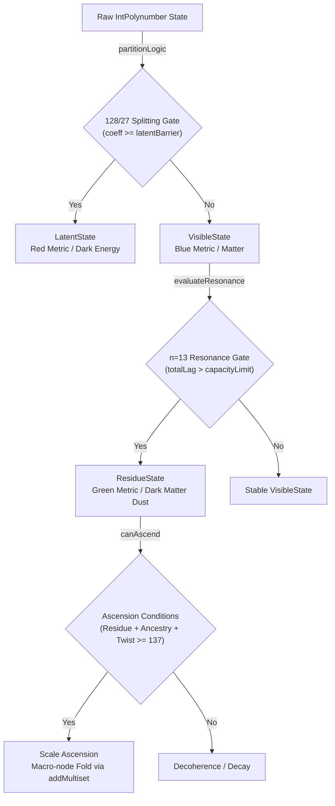

# Physics Olog

This document maps the concrete Idris implementation of the Linear Physics engine directly to their physical concepts.

## Core Modules

### SpreadPolynumber.idr
*   **Physics:** Geodesic Operator Generator / Localized Chromogeometric Propagator
*   **Implementation:** Maps localized Maxel triad spreads to distinct `IntPolynumber` monomials.

### Init.idr
*   **Physics:** Primordial Vacuum Seed / Chromogeometric Background State
*   **Implementation:** Populating a baseline Substrate and SparseMaxel grid at T=0.

---

## Transform Gates (Transform.idr)

### 128/27 Polynomial Splitting Gate (Baryogenesis Filter)
*   **Implementation:** Filters `IntPolynumber` terms by coefficient threshold.
    *   `coeff >= latentBarrier` → LatentState (Red Metric / Dark Energy)
    *   `coeff < latentBarrier` → VisibleState (Blue Metric / Matter)

### n=13 Resonance Scattering (Wavefunction Collapse / Decoherence)
*   **Implementation:** If `totalLag > capacityLimit`, it shatters every visible polynomial term through a modulo filter, producing the ResidueState (Green Metric).

### Scale Ascension (Emergence Phase Transition / Holonomy Collapse)
*   **Implementation:** Folds all micro-polynomials into a single macro-node via `addMultiset`.

### Three-Fold Primorial Gauge Barrier (Emergence Threshold Gate)
*   **Implementation:** Evaluates the combined weight of the current state, ancestral graph, and twist.

### Ascension Conditions & Harmonic Scale Lock (Gauge Closure)
The three requirements for ascension phase transition:
1.  **Residue Lag:** A non-zero ResidueState must survive the n=13 gate. Without raw material (dark matter dust), there is nothing to aggregate into the macro-node.
2.  **Ancestral Context:** The Scale N layer must read Scale N-1 boundary conditions (the Substrate causal density). Without this, the system lacks a metric to organise its collective behaviour.
3.  **Twist Capacity:** The Chromogeometric $A(Q) = T(s)$ structural lock must hold. This is the "twisting" or holonomy that prevents the macro-node from flying apart.
