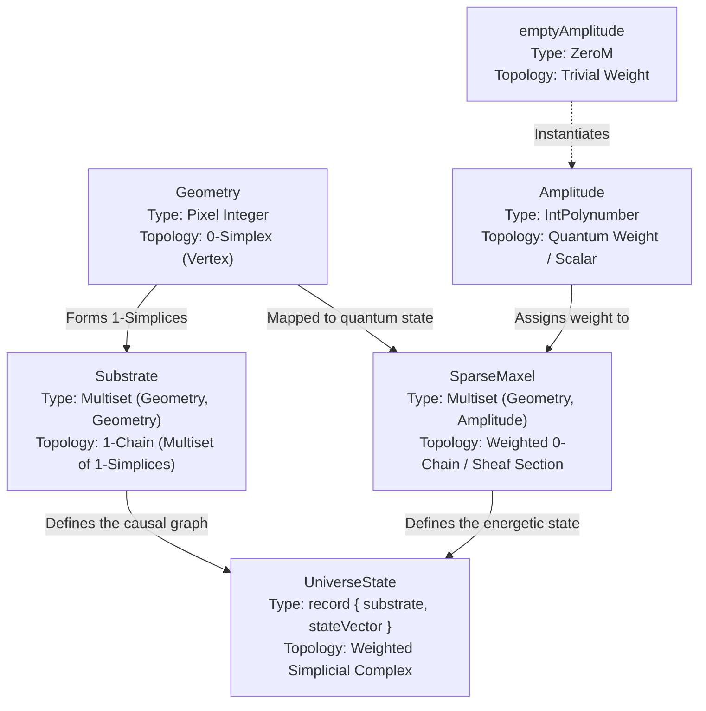

# The Simplicial Architecture of the UniverseState

In Linear Physics, the entire topological and quantum state of the universe is modelled as a **Weighted Simplicial Complex**. By breaking down the core data structures in `Simplex.Core`, we can map the exact Idris 2 types to their topological equivalents.

## The Core Types as Simplices



### 1. `Geometry` (The 0-Simplex)
```idris
Geometry = Pixel Integer
```
A **0-Simplex** is a zero-dimensional point. In our engine, this is a distinct spatial coordinate on the integer grid. It serves as the elementary building block (vertex) of the universe.

### 2. `Substrate` (The 1-Chain)
```idris
Substrate = Multiset (Geometry, Geometry)
```
A **1-Simplex** is a line segment connecting two 0-simplices, represented here as an ordered pair `(Geometry, Geometry)`. By forming a `Multiset` of these 1-simplices, the `Substrate` becomes a **1-Chain** — a formal directed causal graph (a spin network). It defines *how* the points of the universe are topologically glued together.

### 3. `Amplitude` & `emptyAmplitude` (The Weights)
```idris
Amplitude = IntPolynumber
emptyAmplitude = ZeroM
```
In algebraic topology, a chain is a formal sum of simplices multiplied by coefficients (weights). Here, our coefficients are quantum polynomials (`IntPolynumber`). If a geometric point has no energy or matter, it is assigned `emptyAmplitude` (which evaluates to the empty multiset `ZeroM`).

### 4. `SparseMaxel` (The Weighted 0-Chain)
```idris
SparseMaxel = Multiset (Geometry, Amplitude)
```
A **0-Chain** is a formal linear combination of 0-simplices. `SparseMaxel` maps every active `Geometry` (0-simplex) to its corresponding `Amplitude` (weight). It acts as the global state vector, describing the exact mass/energy distribution across the spatial vertices.

### 5. `UniverseState` (The Full Simplicial Complex)
```idris
record UniverseState where
  substrate   : Substrate
  stateVector : SparseMaxel
```
The total `UniverseState` combines the structural geometry (`Substrate` / 1-simplices) with the energy distribution (`stateVector` / weighted 0-simplices). This means the entire deterministic evolution of the universe is just the algorithmic manipulation of a **Weighted Simplicial Complex**. 

The engine uses this exact architecture to calculate curvature, torsion, and holonomy (the Twist) entirely through discrete simplex operations!

---

## Topological Summary Checklist

If we audit the universe against formal Algebraic Topology, the mathematical definitions map perfectly:

*   `Geometry` = **0-Simplex** (An isolated spatial vertex)
*   `(Geometry, Geometry)` = **1-Simplex** (A single directed edge between two vertices)
*   `Substrate` = **1-Chain** (The 1-skeleton: a multiset or formal sum of the 1-simplices)
*   `Amplitude` = **Quantum Coefficient / Scalar** (The ring element evaluated over the simplex)
*   `SparseMaxel` = **Weighted 0-Chain** (The multiset assigning quantum amplitude weights to the 0-simplices)
*   `UniverseState` = **Weighted Simplicial Complex** (The complete topological space uniting the 1-Chain spatial structure with the 0-Chain energetic distribution)
