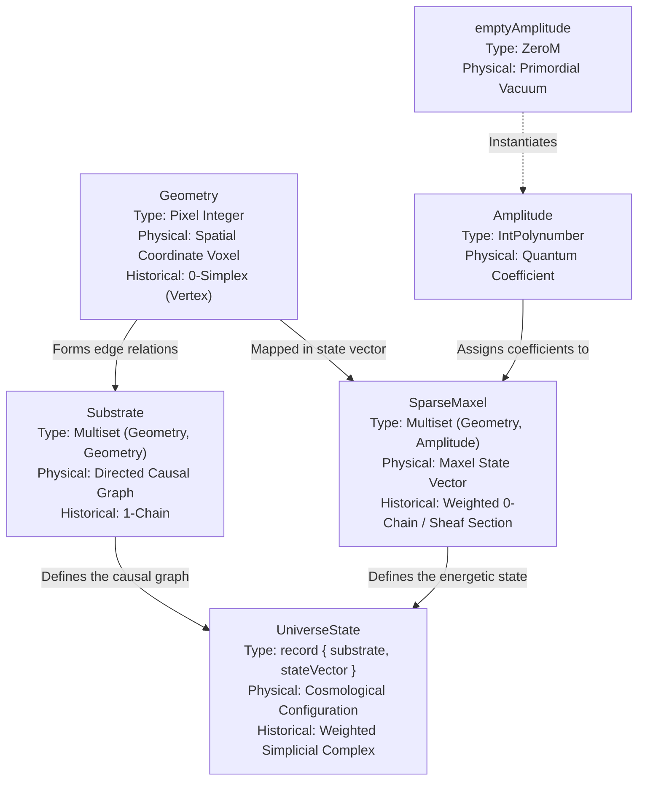

# The Discrete Multiset Architecture of the UniverseState

In the LUniverse, the spatial substrate and quantum state are modeled purely as **Discrete Coordinate Multisets**. By breaking down the core data structures in `Simplex.Core`, we can map the exact Idris 2 types to their physical meanings and historical topological equivalents.

## The Core Types as Coordinate Multisets



### 1. `Geometry` (The Spatial Voxel / Historical: 0-Simplex)
```idris
Geometry = Pixel Integer
```
A coordinate voxel on the discrete integer grid. It serves as the elementary building block (vertex) of the spatial grid.

### 2. `Substrate` (The Causal Graph / Historical: 1-Chain)
```idris
Substrate = Multiset (Geometry, Geometry)
```
A directed causal connection mapping a parent coordinate to a child coordinate. By forming a `Multiset` of these directed relations, the `Substrate` becomes the complete causal graph of spacetime. It dictates *how* information propagates through the discrete space.

### 3. `Amplitude` & `emptyAmplitude` (The Quantum Coefficients)
```idris
Amplitude = IntPolynumber
emptyAmplitude = ZeroM
```
Our coordinate weights are quantum polynomials (`IntPolynumber`). If a coordinate voxel has no active state, it is assigned `emptyAmplitude` (the empty multiset `ZeroM`).

### 4. `SparseMaxel` (The Maxel State Vector / Historical: Weighted 0-Chain or Sheaf Section)
```idris
SparseMaxel = Multiset (Geometry, Amplitude)
```
A formal linear combination mapping active `Geometry` coordinates to their corresponding `Amplitude` polynomial. It acts as the global state vector, describing the mass/energy distribution across the spatial voxels.

### 5. `UniverseState` (The Cosmological Configuration / Historical: Weighted Simplicial Complex)
```idris
record UniverseState where
  substrate   : Substrate
  stateVector : SparseMaxel
```
The total `UniverseState` combines the structural geometry (`Substrate` causal relations) with the energy distribution (`stateVector` Maxel State Vector). The entire cosmological evolution of the universe is represented as the algorithmic manipulation of these **Discrete Coordinate Multisets**. 

The engine uses this clean architecture to calculate curvature, torsion, and holonomy (the Twist) entirely through discrete multiset operations.

---

## Nomenclature Alignment Checklist

When auditing the codebase against formal algebraic geometry and historical continuous topology, the mathematical concepts map perfectly:

*   `Geometry` = **Spatial Coordinate Voxel** (Historical: 0-Simplex / Vertex)
*   `(Geometry, Geometry)` = **Directed Causal Edge** (Historical: 1-Simplex)
*   `Substrate` = **Directed Causal Graph** (Historical: 1-Chain / Poset)
*   `Amplitude` = **Quantum Coefficient / Scalar** (Historical: Ring Element / Fiber value)
*   `SparseMaxel` = **Maxel State Vector** (Historical: Weighted 0-Chain / Sheaf Section)
*   `UniverseState` = **Cosmological Configuration** (Historical: Weighted Simplicial Complex)
