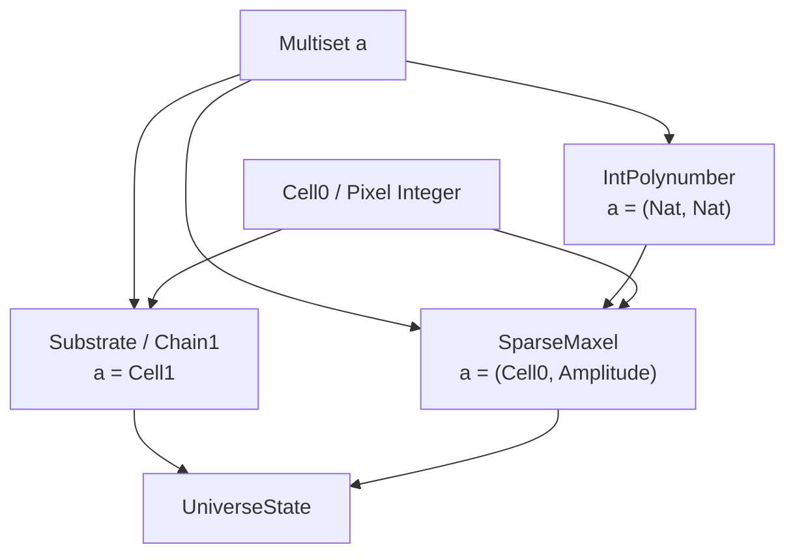

# Mathematical Type Architecture

This document shows the complete type signatures of the Multiset-based mathematical architecture. Every physical concept in the LUniverse is built from these types — there are no special-purpose wrappers or ad-hoc structures.

> [!NOTE]
> View the live **[Code Verification Matrix](../Code/Verification_Matrix.md)** to see the automated property tests that formally verify the causal and topological guarantees of these data structures.

---

## Layer 1: Linear Foundation (`Math.UnaryMultiset`)

The base data structure. QTT linearity (`1`) ensures every element is consumed exactly once.

```idris
-- The linear multiset: every atom must be accounted for
0 UnaryMultiset : Type -> Type
```

This is the **No-Cloning Theorem** as a type. You cannot duplicate an `Add` node — the compiler forbids it.

### Signed Variant (`Math.SignedUnaryMultiset`)

Matter/Antimatter annihilation as a data structure:

```idris
0 SignedUnaryMultiset : Type -> Type

annihilate : Eq a => SignedUnaryMultiset a -> SignedUnaryMultiset a
```

---

## Layer 2: Run-Length Encoded Multiset (`Math.Multiset`)

High-performance representation for large-scale computation. Each element carries an Integer multiplicity (positive = matter, negative = antimatter):

```idris
0 Multiset : Type -> Type

-- Non-empty variant (prevents division-by-zero in spreads)
0 Multiset1 : Type -> Type
```

**This is the engine.** Every physical type alias in the system resolves to `Multiset something`.

---

## Layer 3: Geometry, Coordinates & Discrete Elements (Historical: Simplices & Chains)

Discrete metrical geometry is defined using structured coordinate multisets!

### Coordinates & Edge Relations — The formal building blocks of geometry

```idris
-- A spatial coordinate cell (Historical: 0-Simplex / 0-Cell) is a naked coordinate point (vertex) in space.
0 Cell0 : Type
Cell0 = Pixel Integer

-- A directed causal relation (Historical: 1-Simplex / 1-Cell) is a directed edge connecting two Cell0s.
0 Cell1 : Type
Cell1 = (Cell0, Cell0)

-- A triadic evaluation domain (Historical: 2-Simplex / 2-Cell) is a face/triangle defined by three Cell0s.
0 Cell2 : Type
Cell2 = (Cell0, Cell0, Cell0)
```

### Multisets of Coordinate Elements (The Shape of the Space)

```idris
-- A Vertex Multiset (Historical: 0-Chain / Chain0) is a formal multiset of vertices (dust/pixels).
0 Chain0 : Type
Chain0 = Multiset Cell0

-- An Edge Multiset (Historical: 1-Chain / Chain1) is a formal multiset of directed edges (causal connections).
0 Chain1 : Type
Chain1 = Multiset Cell1

-- A Triangle Multiset (Historical: 2-Chain / Chain2) is a formal multiset of triangles (spread metrical evaluation domain).
0 Chain2 : Type
Chain2 = Multiset Cell2
```

---

## Layer 4: Polynumbers (`Math.Polynumber`, `Math.IntPolynumber`)

### Linear Polynumber (QTT layer)

```idris
0 PowerBasis : Type
PowerBasis = LPair (UnaryMultiset ()) (UnaryMultiset ())   -- (α power, β power)

0 PolyTerm : Type
PolyTerm = LPair PowerBasis (UnaryMultiset ())              -- basis + coefficient

0 Polynumber : Geometry -> Type
Polynumber geom = UnaryMultiset PolyTerm
```

### Integer Polynumber (computation layer)

```idris
IntPolynumber : Type
IntPolynumber = Multiset (Nat, Nat)    -- RLE: (α power, β power) → Integer coefficient
```

### Spread Polynomial

```idris
-- The recurrence: S_n(s) = 2(1-2s)·S_{n-1}(s) - S_{n-2}(s) + 2s
spreadPoly : Nat -> IntPolynumber
```

---

## Layer 5: Rational Trigonometry & Chromogeometry (`Math.Chromogeometry`)

We have stripped away legacy linear types (`Fraction`, `Spread`, `Quadrance` records) in favor of pure integer coordinate math. This completely immunises the engine from floating-point drift and structural decay.

```idris
-- Exact rational integer math. No division truncation!
quadranceNL : Metric -> Cell0 -> Cell0 -> Integer
spreadNL    : Metric -> Cell0 -> Cell0 -> Cell0 -> (Integer, Integer)
archimedesNL: Metric -> Cell0 -> Cell0 -> Cell0 -> Integer
```

The Three-Fold Spread Theorem is mathematically guaranteed via exact cross-multiplication over triad geometry.

---

## Layer 6: Physics Type Aliases (`Simplex.Core`)

Every physical concept is a **type alias** over the Multiset engine. No wrappers.

```idris
-- A coordinate on the integer pixel grid (Legacy alias for Cell0)
0 Geometry  : Type
Geometry = Cell0

-- A polynomial amplitude at a coordinate
0 Amplitude : Type
Amplitude = IntPolynumber                  -- = Multiset (Nat, Nat)

-- The causal graph (directed edges between coordinates)
0 Substrate : Type
Substrate = Chain1                         -- = Multiset Cell1

-- The quantum state vector (coordinates mapped to amplitudes)
0 SparseMaxel : Type
SparseMaxel = Multiset (Geometry, Amplitude)  -- = Multiset (Cell0, Multiset (Nat, Nat))

-- The complete universe state
0 UniverseState : Type
```

### The Architecture Diagram



All physical types are the **same data structure** parameterised differently. An optimisation to `Multiset.idr` automatically improves the causal graph, the state vector, the polynomials, and the spread computations simultaneously!

---

## Layer 7: Twist and Localized Evolution (`Simplex.Twist` & `Evolution.SpreadPolynumber`)

### Twist (Gauge Field Holonomy)

Computes rational gauge field interference directly via metric combination:
```idris
computeTwist : Metric -> Metric -> Metric -> IntPolynumber
```

### Spread Propagators

Bridge functions that map spatial chromogeometric curvature directly into an active time-evolution Polynumber operator.

```idris
generateLocalSpreadPoly : Metric -> Substrate -> Cell0 -> IntPolynumber

stepUniverseLocalized : Integer -> Metric -> Substrate -> SparseMaxel -> (Substrate, SparseMaxel)
```

---

## Layer 8: Cosmological Evolution (`Evolution`)

The temporal engine orchestrates the phase transitions across scales.

### `Evolution.State`
```idris
0 Flavor : Type

-- Replaces DarkPlusMatter! A bundle attached to a Cell0 containing its exact state vector, generation depth, and frozen spatial topology.
0 CellState : Type
```

### `Evolution.Transform` & `Gate`
Coordinate partition and resonance logic applied globally across the state vector during a clock tick.

```idris
partitionLogic : Integer -> Cell0 -> IntPolynumber -> (IntPolynumber, IntPolynumber)
evaluateResonance : Integer -> Integer -> Cell0 -> IntPolynumber -> IntPolynumber
```

---

## The Naming Zoo

Historical aliases that resolved to these types:

| Old Name | Current Type | Resolves To |
|---|---|---|
| FiberBundle | `SparseMaxel` | `Multiset (Cell0, IntPolynumber)` |
| StateVector | `SparseMaxel` | `Multiset (Cell0, IntPolynumber)` |
| SpacetimeManifold | `Substrate` | `Multiset Cell1` |
| Poset | `Substrate` | `Multiset Cell1` |
| Sheaf | `SparseMaxel` | `Multiset (Cell0, IntPolynumber)` |
| DenseAMSet | `Multiset` | `Multiset a` |
| AMSet | `SignedUnaryMultiset` | `record { 1 pos, 1 neg : UnaryMultiset a }` |
| MaxelNL Cell0 | `Chain0` | `Multiset Cell0` |
| DarkPlusMatter | `CellState` | `record { generation, statePoly, maxelProjection, flavor }` |
