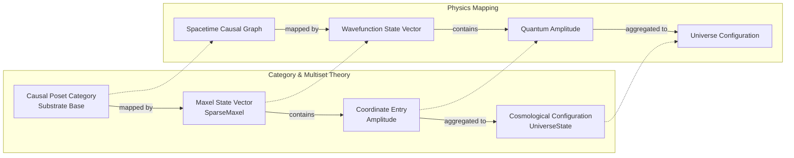

# Mathematical Olog

This document maps the concrete Idris data structures and logic of the Linear Physics engine to their formal counterparts in Category Theory, Discrete Geometry, and Rational Trigonometry.

## Multiset Causal Flow & Boundary (Core.idr)

| Concept / Category Theory | Physics Alias | Concrete Multiset Implementation |
|---|---|---|
| **Object of the Base Category / Point of the Causal Poset** | Spacetime Voxel / Chromogeometric Coordinate | A two-component integer pair `(x, y)` where each component carries a magnitude evaluable under any of the three Metrics. |
| **Coordinate Entry / Local Value (Historical: Local Section / Fiber Value)** | Quantum Amplitude / Polynumber / Fock State | A Run-Length Encoded multiset `IntPolynumber = Multiset (Nat, Nat)` of (alpha, beta) power pairs. |
| **Causal Poset Category / Substrate Base (Historical: Base Space of Sheaf)** | Spacetime Manifold / Causal Graph / Spin Foam | A `Multiset (Geometry, Geometry)` of directed edges. Each entry encodes causal precedence. |
| **Maxel State Vector / Wavefunction (Historical: Sheaf of Polynumbers / Fiber Bundle)** | State Vector / Fock Space Configuration | `Multiset (Pixel Integer, IntPolynumber)` mapping each active coordinate pixel to its quantum amplitude polynomial. |
| **Cosmological Configuration (Historical: Global Section of Sheaf)** | Total Cosmological State / Universe Configuration | `(Multiset (G,G), Multiset (G, Vector))` - the unified product type `UniverseState`. |
| **Total Weight of Arrow Ideals** | Local Proper Time / Causal Mesh Delay | Sum of multiplicities of all directed edges in the causal graph (`substrateLag`). |
| **Coproduct in the Base Category** | Causal Merge / Time Step Advance | `addMultiset` over the substrate causal graph. |
| **Coordinate Entry at a Point (Historical: Stalk of Sheaf at a Point)** | Point Particle / Localized Wavepacket | A unit coordinate-amplitude pair isolated from the global multiset. |
| **Coproduct of State Vectors** | Quantum Superposition / State Overlap | `addMultiset` over the state vector. |
| **Global Sections Cardinality** | Total Energy / Occupation Number | Total sum of all polynomial coefficients. |
| **Coordinate Filter (Historical: Sheaf Restriction Map)** | Local Measurement / Projection | Filtering or evaluating a local section (`restrictToPixel`). |
| **Causal Parity Gluing (Historical: Gluing Condition of Sheaf)** | Causal Consistency / No-Signalling Check | Synchronization check (`isSynchronised`) verifying that every active state coordinate has causal history in the Substrate. |
| **Boundary Operator ($\partial$)** | Causal Flow Boundary | The exact difference vector between target and source (`boundaryNL`). |
| **Chain Boundary Map** | Causal Boundary Shredder | Shredding edge relation multisets to vertex flow weights (`runBoundary` / `applyBoundary`). |

---

## Metric & Rational Trigonometry (Chromogeometry.idr)

| Mathematical Concept | Physics Alias | Implementation Details |
|---|---|---|
| **Objects of the Morphic Metric Category** | Chromogeometric Metric Gauge Symmetries | Explicit algebraic flags for Blue (Euclidean), Red/Green (Minkowskian Relativistic). |
| **Rational Quadrance $Q(p_1, p_2)$** | Spacetime Interval / Squared Distance / Metrical Norm | $x^2+y^2$ (Blue), $x^2-y^2$ (Red), $2xy$ (Green). |
| **Archimedes Invariant $A(Q_1, Q_2, Q_3)$** | Triadic Curvature / Symmetric Area Invariant | The symmetric quadratic form over the three edge quadrances of a triangle. |
| **Rational Spread $s(l_1, l_2)$** | Gauge Field Angle / Vector Deflection Ratio | The exact rational ratio replacing continuous trigonometric angles. |

---

## Holonomy & Twist (Twist.idr)

| Mathematical Concept | Physics Alias | Implementation Details |
|---|---|---|
| **Exact Metric Spread $s(p_1, p_2, p_3)$** | Chromogeometric Twisting / Gauge Field Holonomy / Curvature | Triad extraction across the active Substrate poset and exact rational cross-multiplication (Numerator / Denominator). |

---

## Unification & Replacement Models (Multiset.idr)

The `Multiset` data structure replaces the need for continuous categorical wrappers. By flattening everything to pure RLE arrays, we map categorical definitions directly to discrete, high-performance linear structures:
*   **Maxel State Vector:** The unified state space metric over the coordinate manifold (historically: `FiberBundle`).
*   **StateVector / State Space:** The quantum superposition states in a linear structure.
*   **Direct Image Filter:** A transformation mapping sections across scale layers (historically: `Direct Image Sheaf`).

---

## Phase Transitions & Ascension (Transform.idr & Init.idr)

*   **Polynomial expansion of Triadic Spreads** (from `SpreadPolynumber.idr`)
*   **Initial Object of the Causal Layout** (from `Init.idr`) — The primordial vacuum state.
*   **Coordinate Filter Map / Tensor Factorisation over Objects** — The 128/27 polynomial splitting phase (historically: Sheaf Restriction Map).
*   **Radical Subtraction / Ideal of the Polynumber Algebra** — The $n=13$ resonance shattering modulo (historically: Sheaf Radical Subtraction).
*   **Left Adjoint Direct Image State Vector** — The ascension condensation producing a singleton state vector at Scale N+1 (historically: Corestriction).
*   **Boundary Flow Parity / Causal Consistency / Holonomy Closure** — The `SigmaGate` boundary conservation and holonomy closure requirements (historically: Sheaf Cohomology Section Existence Criteria).
*   **Direct Image State Vector Monad Functor Verification Section** — The three-fold gauge barrier execution (historically: Direct Image Sheaf Monad Functor Verification Section).
