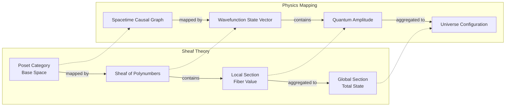

# Mathematical Olog

This document maps the concrete Idris data structures and logic of the Linear Physics engine to their formal counterparts in Category Theory, Topology, and Rational Trigonometry.

## Core Topology & Sheaf Theory (Core.idr)

| Concept / Category Theory | Physics Alias | Concrete Implementation |
|---|---|---|
| **Object of the Base Category / Point of the Poset** | Spacetime Voxel / Chromogeometric Coordinate / Spin State | A two-component integer pair `(x, y)` where each component carries a magnitude evaluable under any of the three Metrics. |
| **Fiber Value / Local Section of the Sheaf** | Quantum Amplitude / Polynumber / Fock State / Energy Coefficient | A Run-Length Encoded multiset `IntPolynumber = Multiset (Nat, Nat)` of (alpha, beta) pairs. |
| **Poset Category / Base Space of the Sheaf** | Spacetime Manifold / Causal Graph / Spin Foam | A `Multiset (Geometry, Geometry)` of directed edges. Each entry encodes causal precedence. |
| **Sheaf of Polynumbers over the Poset Base Space** | Fiber Bundle / Wavefunction / Fock Space State Vector | `Multiset (Pixel Integer, IntPolynumber)` mapping each pixel to its local quantum amplitude polynomial. |
| **Global Section of the Sheaf** | Total Cosmological State / Universe Configuration | `(Multiset (G,G), Multiset (G, Vector))` - the unified product type. |
| **Total Weight of Arrow Ideals** | Local Proper Time / Causal Mesh Delay | Sum of multiplicities of all directed edges in the causal graph. |
| **Coproduct in the Poset Category** | Causal Merge / Time Step Advance | `addMultiset` over the substrate causal graph. |
| **Stalk of the Sheaf at a Point** | Point Particle / Localized Wavepacket | A unit section isolated from the global multiset. |
| **Coproduct of Sheaf Sections** | Quantum Superposition / State Overlap | `addMultiset` over the state vector. |
| **Global Sections Cardinality** | Total Energy / Occupation Number | Total sum of all polynomial coefficients. |
| **Restriction Map of the Sheaf** | Local Measurement / Projection | Filtering or evaluating a local section. |
| **Gluing Condition of the Sheaf** | Causal Consistency / No-Signalling Check | Synchronization check between Substrate and State Vector. |

---

## Metric & Rational Trigonometry (Chromogeometry.idr)

| Mathematical Concept | Physics Alias | Implementation Details |
|---|---|---|
| **Objects of the Morphic Metric Category** | Chromogeometric Metric Gauge Symmetries | Explicit algebraic flags for Blue (Euclidean), Red/Green (Minkowskian Relativistic). |
| **Rational Quadrance $Q(p_1, p_2)$** | Spacetime Interval / Squared Distance / Metrical Norm | $x^2+y^2$ (Blue), $x^2-y^2$ (Red), $2xy$ (Green). |
| **Archimedes Invariant $A(Q_1, Q_2, Q_3)$** | Triadic Curvature / Symmetric Area Invariant | The symmetric quadratic form over the three edge quadrances of a triangle. |
| **Rational Spread $s(l_1, l_2)$** | Gauge Field Angle / Vector Deflection Ratio | The exact rational ratio replacing continuous trigonometric angles. |

---

## Holonomy & Twist (Twist.idr)

| Mathematical Concept | Physics Alias | Implementation Details |
|---|---|---|
| **Exact Metric Spread $s(p_1, p_2, p_3)$** | Chromogeometric Twisting / Gauge Field Holonomy / Curvature | Triad extraction across the active Substrate poset and exact rational cross-multiplication (Numerator / Denominator). |

---

## Unification & Replacement Models (Multiset.idr)

The `Multiset` data structure replaces the need for categorical wrappers. By flattening everything to pure RLE arrays, we map categorical definitions directly to linear structures:
*   **FiberBundle:** The unified state space metric over the topological manifold.
*   **StateVector / State Space:** The quantum super-position states in a linear structure.
*   **Direct Image Sheaf:** A transformation mapping sections across layers.

---

## Phase Transitions & Ascension (Transform.idr & Init.idr)

*   **Polynomial expansion of Triadic Spreads** (from `SpreadPolynumber.idr`)
*   **Initial Object of the Sheaf Manifold Layout** (from `Init.idr`) — The primordial vacuum state.
*   **Sheaf Restriction Map / Tensor Factorisation over Objects** — The 128/27 polynomial splitting phase.
*   **Sheaf Radical Subtraction / Ideal of the Polynumber Algebra** — The $n=13$ resonance shattering modulo.
*   **Corestriction / Left Adjoint Direct Image Section** — The ascension condensation producing a singleton FiberBundle at Scale N+1.
*   **Sheaf Cohomology Section Existence Criteria / Gluing Condition** — The 3 requirements for Holonomy closure.
*   **Direct Image Sheaf Monad Functor Verification Section** — The three-fold gauge barrier execution.
