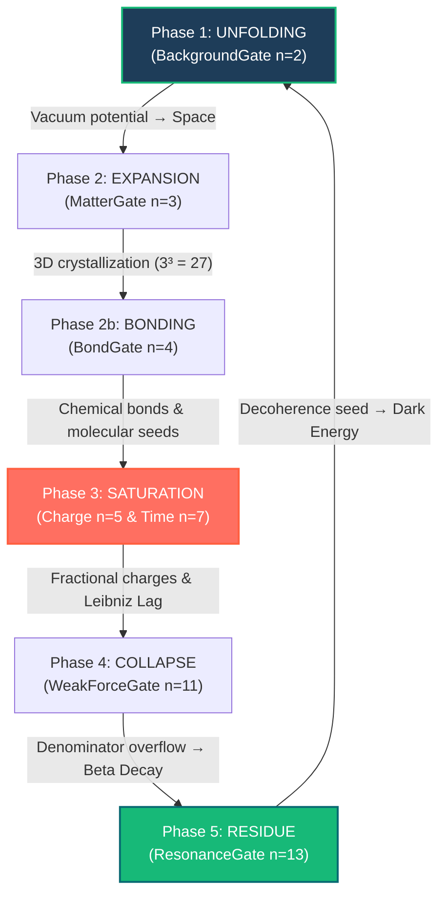

# idris2-Universe-Wiki

**The living, executable mathematical and physical documentation for the [Nat-Science](https://github.com/justinkelly-ie/Nat-Science) model.**

[](https://github.com/idris-lang/Idris2)
[]()
[]()

---

## Overview

Welcome to the **Natural Universe Wiki**. This repository serves as the definitive reference manual and living mathematical oracle for the **Nat-Science** project — a unified discrete natural science model built entirely over Natural Numbers (`Nat`).

Unlike traditional static wikis, this codebase is **executable**. Every chapter combines deep theoretical physics, chromogeometric mathematical diagrams, and **Literate Idris 2 (`.md`) property-based proofs**. 

When compiled, the wiki executes **55+ system-level QuickCheck properties** to structurally verify that the laws of nature — Conservation of Mass, Monotonic Causality, Baryogenesis, and Pythagorean Fixed Points — are strictly enforced by the underlying multiset algebra.

---

## The 5-Phase Adaptive Cycle

The cosmic heartbeat is governed by the recursive convolution of prime-based Spread Polynomials across the universal Adaptive Cycle:



---

## Interactive Wiki Navigation (TOC)

Click on the links below to explore the theoretical chapters and their live, compile-time property proofs directly on GitHub:

### 📖 [Physics & Cosmology Core](Library/Wiki/Physics/Index.md)
*   ⚛️ **[Primorial Particle Mapping](Library/Wiki/Physics/Particles.md)** — How standard model particles and molecular bonds emerge from prime spread gates.
*   🔄 **[Recursive Multiset Composition](Library/Wiki/Physics/Recursive_Composition.md)** — Time, scale transitions, and the 137-scale trajectory as recursive polynomial composition.
*   📐 **[Three-Metric Chromogeometry](Library/Wiki/Physics/Theorems.md)** — Wildberger's RGB rational coordinates (Euclidean Blue, Minkowski Red, Product Green) without decimal drift.
*   ⏳ **[Causal Evolution & Leibniz Lag](Library/Wiki/Physics/UniverseState.md)** — The strict monotonic topology of `UniverseState` and the empty vacuum anchor.
*   🧪 **[Elements & H₂O Bond Chemistry](Library/Wiki/Physics/Elements.md)** — Explaining why Water coordinate `(4,3)` is a Pythagorean Fixed Point.

### 💻 [Code & Mathematical Engine](Library/Wiki/Code/Index.md)
*   🧮 **[Sigma-Linear Execution Engine](Library/Wiki/Code/architecture.md)** — The $O(N)$ dependent multiset bridge that maps unrestricted runtime calculations into the type signature.
*   ✅ **[Verification Oracle](Library/Wiki/Code/Engine_Verification.md)** — Property-based tests verifying the integrity of the underlying QuickCheck primitive framework.
*   📊 **[Live Code Verification Matrix](Library/Wiki/Code/Verification_Matrix.md)** — Automated test matrices proving causal density and polynomial superposition invariants.

### 🧬 [Discrete Topology Foundations](Library/Wiki/Simplex/Simplicial_Architecture.md)
*   🕸️ **[Topological Types & Relations](Library/Wiki/Simplex/Types.md)** — How the entire universe is modeled as a single parameterized `Multiset` type alias.
*   ➰ **[Spread Polynomial Locking](Library/Wiki/Simplex/Spread_Polynomial.md)** — Formalizing the helical locks behind biological alpha helices, DNA, and neurological cortical folds.

---

## How to Compile & Verify the Wiki

The wiki compiles into a binary that executes all property tests and writes the live results back into your markdown pages, updating the verification matrices in real-time.

### Inside the `fedora-toolbox-44` container:

```bash
# 1. Clone sibling repos (Nat-Science, idris2-Universe, idris2-Multiset, idris2-Chromogeometry, idris2-QuickCheck)

# 2. Build the wiki package:
pack build idris2-Universe-Wiki.ipkg

# 3. Execute the living proofs:
./build/exec/luniverse
```

This will run all 55+ QuickCheck properties and automatically write the results to:
*   [Physics Verification Matrix](Library/Wiki/Physics/Verification_Matrix.md)
*   [Code Verification Matrix](Library/Wiki/Code/Verification_Matrix.md)

---

© Justin Kelly. All rights reserved.
