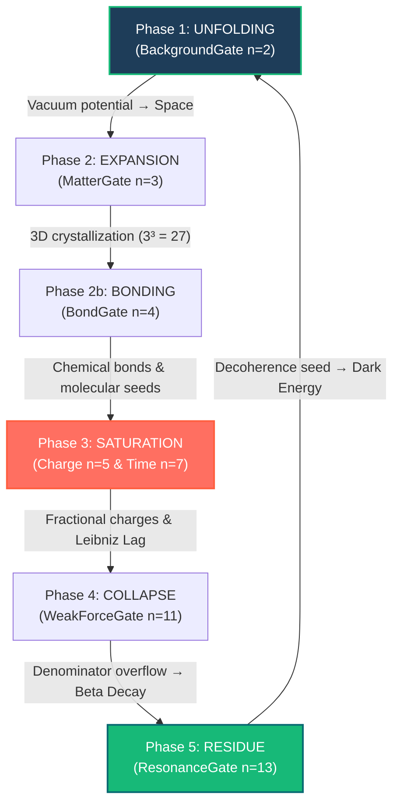

# idris2-Universe-Wiki

**The living, executable mathematical and physical documentation for the [Nat-Science](https://github.com/justinkelly-ie/Nat-Science) model.**

[](https://github.com/idris-lang/Idris2)
[]()
[]()

---

## Overview

Welcome to the **Natural Universe Wiki**. This repository serves as the definitive reference manual and living mathematical oracle for the **Nat-Science** project — a unified discrete natural science model built entirely over Natural Numbers (`Nat`).

Unlike traditional static wikis, this codebase is **executable**. Every chapter combines deep theoretical physics, chromogeometric mathematical diagrams, and **Literate Idris 2 (`.md`) property-based proofs**. 

When compiled, the wiki executes **74 system-level QuickCheck properties** to structurally verify that the laws of nature — Conservation of Mass, Monotonic Causality, Baryogenesis, and Pythagorean Fixed Points — are strictly enforced by the underlying multiset algebra.

---

## The 5-Phase Adaptive Cycle

The cosmic heartbeat is governed by the recursive convolution of prime-based Spread Polynomials across the universal Adaptive Cycle:



---

## Interactive Wiki Navigation (TOC)

Every directory in the Literate Wiki has a dedicated **`Index.md`** serving as the section portal, detailing the underlying physics, mathematical models, and live compile-time proofs. Click on the headers below to explore each section:

### [1. Discrete Geometry & Grid Architecture (Simplex)](Library/Wiki/Simplex/Index.md)
*   **[Simplicial Architecture](Library/Wiki/Simplex/Simplicial_Architecture.md)** — Introduction to discrete spatial pixels and directed acyclic substrates.
*   **[Topological Types & Relations](Library/Wiki/Simplex/Types.md)** — Core type definitions of basis powers, polynomial terms, and coordinate bindings.
*   **[Monotonic Simplex Properties](Library/Wiki/Simplex/Properties.md)** — Proofs of monotonic coordinate relations and labeled graph extractions.
*   **[Spread Polynomial Resonance](Library/Wiki/Simplex/Spread_Polynomial.md)** — Helical locks behind biological alpha helices, DNA, and neurological folds.
*   **[Ontological Log (olog)](Library/Wiki/Simplex/olog.md)** — Category-theory ontology of simplicial grid relationships.

### [2. Physical Symmetries & The Particle Zoo (Symmetry)](Library/Wiki/Symmetry/Index.md)
*   **[Primorial Particle Mapping](Library/Wiki/Symmetry/Particles.md)** — Mappings of standard model particles to prime-number filtering gates on the pixel grid.
*   **[Common QuickCheck Harness](Library/Wiki/Symmetry/Common.md)** — Universal state graph serializations and QuickCheck state generator interfaces.
*   **[Symmetry Ontology (olog)](Library/Wiki/Symmetry/olog.md)** — Category-theory ontology of metrical and coordinate symmetries.

### [3. Physical Derivations & Phenomena (Derivation)](Library/Wiki/Derivation/Index.md)
*   **[Dimensional Causality](Library/Wiki/Derivation/DimensionalCausality.md)** — Rigorous coordinate-sum strict monotonicity proving the absence of causal cycles.
*   **[Double-Slit Interference](Library/Wiki/Derivation/Double_Slit_Interference.md)** — Wave projection and bright/dark fringe properties on the discrete grid.
*   **[Epoch Injection & Baryogenesis](Library/Wiki/Derivation/EpochInjection.md)** — Starting simulations at the Phase 2 baryogenesis threshold.
*   **[Gravitational Time Dilation](Library/Wiki/Derivation/GravitationalTimeDilationVerification.md)** — Relational clock warping driven by computational Leibniz lag density.
*   **[Label Extraction](Library/Wiki/Derivation/LabelExtraction.md)** — Dynamic serialization of the `UniverseState` into JSON labels.
*   **[Theorems of Discrete Physics](Library/Wiki/Derivation/Theorems.md)** — Core mathematical theorems of discrete physics.
*   **[UniverseState Structure](Library/Wiki/Derivation/UniverseState.md)** — Causal substrate and state vector functional primitives.
*   **[Vacuum Pair Production](Library/Wiki/Derivation/VacuumPairProductionVerification.md)** — Virtual particle Schwinger fluctuations and absolute charge invariants.

### [4. Evolution & The Adaptive Cycle (Evolution)](Library/Wiki/Evolution/Index.md)
*   **[Evolutionary Cycles](Library/Wiki/Evolution/Evolution.md)** — Introduction to universal cycle equations and state transitions.
*   **[Adaptive Cycle: Pipeline](Library/Wiki/Evolution/Adaptive_Cycle_Pipeline.md)** — Simulating the Partition, Resonance, and Ascension phases.
*   **[Adaptive Cycle: Findings](Library/Wiki/Evolution/Adaptive_Cycle_Findings.md)** — Static proofs of the 210 primorial grid limit and alpha trajectory.
*   **[Adaptive Cycle: Chemistry](Library/Wiki/Evolution/Adaptive_Cycle_Chemistry.md)** — Mappings of electron spreads and molecular stability.
*   **[Adaptive Cycle: Scales](Library/Wiki/Evolution/Adaptive_Cycle_Scales.md)** — Multi-scale trajectory folds from ice geometry up to biological folds.

### [5. Conservation Laws & Invariants (Invariant)](Library/Wiki/Invariant/Index.md)
*   **[Color Confinement Verification](Library/Wiki/Invariant/ColorConfinementVerification.md)** — Triad and dyad colorless stability ($A(Q) = T(s)$).
*   **[Energy Conservation Verification](Library/Wiki/Invariant/EnergyConservationVerification.md)** — Spatial quadrance and multiset degree conservation.
*   **[Pauli Exclusion Verification](Library/Wiki/Invariant/PauliExclusionVerification.md)** — Validating coordinate overlap detection.
*   **[Primorial Conservation Verification](Library/Wiki/Invariant/PrimorialConservationVerification.md)** — Enforcing the 210 constituent state pool boundary.
*   **[Beta Decay (Weak Force)](Library/Wiki/Invariant/WeakForce.md)** — Decay products triggered by $n=11$ arithmetic overflow.

### [6. System Frameworks & Periodic Chemistry (System)](Library/Wiki/System/Index.md)
*   **[Relational Periodic Table](Library/Wiki/System/PeriodicTableVerification.md)** — Feynmanium stability limit $Z \le 137$ and nucleosynthesis peak lags.
*   **[Hadron Gluon Dynamics](Library/Wiki/System/HadronGluonDynamicsVerification.md)** — Localized color charge pivots (matrix rotations).
*   **[Spread 13 Resonance](Library/Wiki/System/Spread13Verification.md)** — Governing boundaries of mass decoherence at $S_{13}(s)$.

### [7. Cosmological Scales & Trajectories (Scale)](Library/Wiki/Scale/Index.md)
*   **[Ascension Trajectory Probe](Library/Wiki/Scale/Ascension_Probe.md)** — Dynamic probe of the 137 cosmological scales.
*   **[Cosmological Scaling Laws](Library/Wiki/Scale/CosmologicalScaling.md)** — Eddington number matches observer epoch $k=38$.
*   **[Recursive Composition](Library/Wiki/Scale/Recursive_Composition.md)** — Hierarchical multi-scale composite folding.

### [8. Code & Mathematical Engine (Code)](Library/Wiki/Code/Index.md)
*   **[Sigma-Linear Execution Engine](Library/Wiki/Code/architecture.md)** — The $O(N)$ dependent multiset bridge mapping runtime to type signature.
*   **[Verification Oracle](Library/Wiki/Code/Engine_Verification.md)** — Verifying QuickCheck primitives.
*   **[Live Code Verification Matrix](Library/Wiki/Code/Verification_Matrix.md)** — Causal density and polynomial superposition invariants.
*   **[Multiset Algebra Engine](Library/Wiki/Code/Multiset.md)** — Detailed internal documentation of the discrete multiset module.
*   **[Idris 2 Compiler Reference](Library/Wiki/Code/Idris2.md)** — Type-checker optimizations and algebraic structures.
*   **[Checks Matrix](Library/Wiki/Code/Checks.md)** — Static validations of types.

### [9. QTT Linear Memory Bridge (Maths)](Library/Wiki/Maths/Index.md)
*   **[Linear Bridge Properties](Library/Wiki/Maths/LinearBridgeProperties.md)** — Compile-time linear bridge round-trips and physical conservation laws.

### [10. Compound Systems & Chemistry (Compound)](Library/Wiki/Compound/Index.md)
*   **[Hydrogen Verification](Library/Wiki/Compound/HydrogenVerification.md)** — Minimal coordinate lag and ground-state valence of 1.
*   **[Oxygen Verification](Library/Wiki/Compound/OxygenVerification.md)** — BackgroundGate valence of 2 and dark energy pool division into 16 quanta.
*   **[Carbon Verification](Library/Wiki/Compound/CarbonVerification.md)** — Organic backbone and 4-valence bonding stability.
*   **[Water Verification](Library/Wiki/Compound/WaterVerification.md)** — Polar $H_2O$ bonds verified at the $(4,3)$ Pythagorean Fixed Point.
*   **[Methane Verification](Library/Wiki/Compound/MethaneVerification.md)** — Balanced tetrahedral $CH_4$ coordinate signatures.
*   **[Iron Verification](Library/Wiki/Compound/IronVerification.md)** — Peak nucleosynthesis stellar core structures.
*   **[Feynmanium Verification](Library/Wiki/Compound/FeynmaniumVerification.md)** — Quantum stability boundaries at $Z=137$.

---

## How to Compile & Verify the Wiki

The wiki compiles into a binary that executes all property tests and writes the live results back into your markdown pages, updating the verification matrices in real-time.

### Inside the `fedora-toolbox-44` container:

```bash
# 1. Clone sibling repos (Nat-Science, idris2-Universe, idris2-Multiset, idris2-Chromogeometry, idris2-QuickCheck)

# 2. Build the wiki package:
pack build idris2-Universe-Wiki.ipkg

# 3. Execute the living proofs:
./build/exec/luniverse
```

This will run all 67 QuickCheck properties and automatically write the results to:
*   [Physics Verification Matrix](Library/Wiki/Verification_Matrix.md)
*   [Code Verification Matrix](Library/Wiki/Code/Verification_Matrix.md)

---

© Justin Kelly. All rights reserved.

